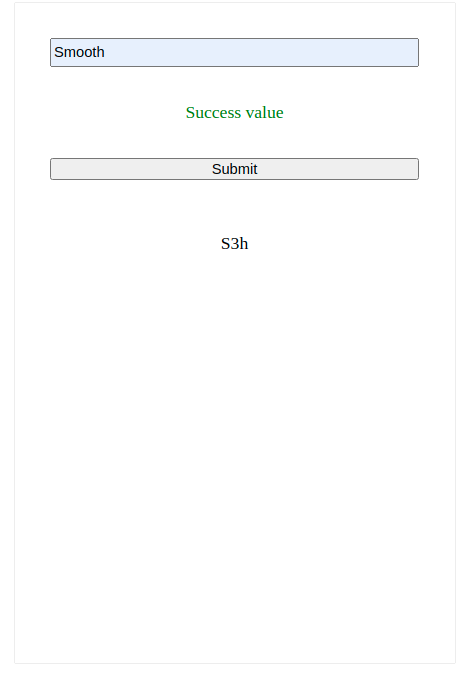

# _VimSolution_

#### _Version 1_
#### _Date 02/3/2021_
#### By _**Adilet Momunaliev**_

## Description

_VimSolution._

## Getting Started

These instructions will get you a copy of the project up and running on your local machine for development and testing purposes.

### Instruction

* Node js in your local machine
* git clone
* npm install
* npm run start
### Specifications
  ;

### License

*_Copyright (c) 2021 **Adilet Momunaliev**_*
